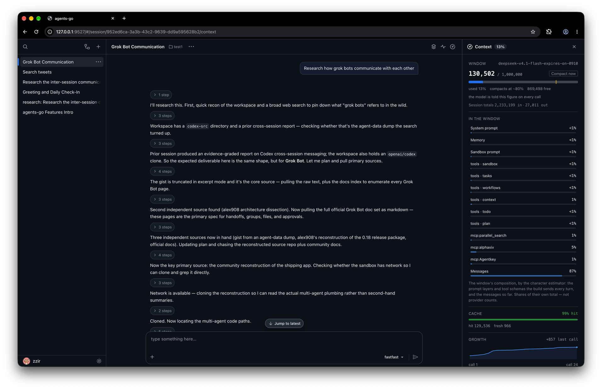

<div align="center">

# agents-go

**Build production AI agents in Go** — tools, handoffs, guardrails, sessions,
human-in-the-loop, streaming, tracing.

Built on the OpenAI **Responses API**. Started as a port of the
[OpenAI Agents SDK](https://github.com/openai/openai-agents-python), now evolving
on its own — behavior is [specified](docs/spec.md), not inherited.

[](https://pkg.go.dev/github.com/zzir/agents-go)
[](https://github.com/zzir/agents-go/actions/workflows/ci.yml)
[](go.mod)
[](LICENSE)

[Documentation](https://zzir.github.io/agents-go/) ·
[Feature reference](docs/features.md) ·
[Examples](docs/examples.md) ·
[Coming from Python?](docs/migration_from_python.md)

</div>

## Why agents-go?

- **Specified behavior** — the run loop, guardrail timing, persistence
  boundaries and budget semantics are written down in [spec.md](docs/spec.md),
  not left to the reader to infer.
- **Type-safe by construction** — tools are generic Go functions; argument
  schemas and structured outputs come from your structs, not runtime dicts.
- **Durable human-in-the-loop** — pause a run for approval, serialize its state
  to JSON, resume it later — even in another process.
- **Production plumbing built in** — retry, fallback, and multi-provider
  routing as composable model decorators; tracing spans for every step.
- **Dependency-light core** — one small module. Docker/SSH sandboxes, SQL
  sessions, and skills are opt-in submodules.
- **Batteries included** — MCP client, code-execution sandboxes, web search,
  Agent Skills, and a full web app on top of the SDK.

## Install

```bash
go get github.com/zzir/agents-go
```

Requires Go 1.26+. Optional backends are separate modules — see
[Packages](docs/features.md#packages).

## Quick start

```go
package main

import (
	"context"
	"fmt"

	agents "github.com/zzir/agents-go/agents"
	"github.com/zzir/agents-go/models/openai"
)

func main() {
	agent := &agents.Agent{
		Name:         "assistant",
		Instructions: agents.StaticInstructions("You are a helpful assistant."),
		Model:        "gpt-4o",
	}

	res, err := agents.Run(context.Background(), agent, "Hello!", agents.RunOptions{
		ModelProvider: openai.NewProvider(), // reads OPENAI_API_KEY
	})
	if err != nil {
		panic(err)
	}
	fmt.Println(res.FinalOutputString())
}
```

## A taste of the API

**Typed tools.** A tool is a plain Go function; its argument struct is
reflected into a strict-mode JSON schema for the model:

```go
type weatherArgs struct {
	City string `json:"city" jsonschema:"the city"`
}

getWeather := agents.NewFunctionTool("get_weather", "Look up the weather.",
	func(ctx context.Context, tc *agents.ToolContext, args weatherArgs) (string, error) {
		return "sunny in " + args.City, nil
	})

agent := &agents.Agent{Name: "bot", Model: "gpt-4o", Tools: []agents.Tool{getWeather}}
```

Structured output is the same idea in reverse: `OutputType[T]()` on the agent,
`FinalOutputAs[T](res)` on the result — see [Agents](docs/agents.md).

**Streaming.** Events arrive as a standard Go iterator:

```go
sr := agents.RunStreamed(ctx, agent, "tell me a story", opts)
for event, err := range sr.Events() {
	if err != nil { panic(err) }
	if e, ok := event.(*agents.RunItemStreamEvent); ok {
		if msg, ok := e.Item.(*agents.MessageOutputItem); ok {
			fmt.Println(msg.Text())
		}
	}
}
res, _ := sr.FinalResult()
```

**Human-in-the-loop.** Runs pause for approval and survive process restarts:

```go
tool.NeedsApproval = true

res, _ := agents.Run(ctx, agent, "delete everything", opts)
for len(res.Interruptions) > 0 {
	for _, item := range res.Interruptions {
		res.State.Approve(item, false) // or res.State.Reject(item, false, "no")
	}
	res, _ = agents.ResumeRun(ctx, res.State, opts)
}
```

The paused state serializes to JSON (`res.State.MarshalJSON()`) and rebuilds
with `agents.RunStateFromJSON(data, registry)` for cross-process approvals.

## What's inside

- [Tools](docs/tools.md) — typed function tools, agents-as-tools, multimodal
  tool output, per-tool approval and guardrails
- [Handoffs](docs/handoffs.md) — triage and delegate between agents
- [Guardrails](docs/guardrails.md) — input, output, and tool-level checks;
  a tripwire halts the run
- [Human-in-the-loop](docs/human_in_the_loop.md) — durable approvals across
  processes
- [Sessions](docs/sessions.md) — in-memory, JSONL file, SQLite/Postgres, or
  OpenAI server-side history with automatic compaction
- [Streaming](docs/streaming.md) — token and item events as a range-able
  iterator
- [Models](docs/models.md) — OpenAI Responses provider; retry, fallback, and
  routing decorators
- [MCP](docs/mcp.md) — stdio and streamable-HTTP tool servers
- [Sandboxes](docs/sandbox.md) — run model-written code in Docker, SSH, or
  local backends; edit files via `apply_patch`
- [Skills](docs/skills.md) — load `SKILL.md` Agent Skills
- [Tracing](docs/tracing.md) — spans for every model call, tool call, handoff,
  and guardrail

The full capability → API map is in the
[feature reference](docs/features.md).

## agents-server

A full-featured **[web app](cmd/agents-server/README.md)** that wraps the
SDK with a versioned REST API, WebSocket streaming, and an embedded browser UI.
Configure agents, MCP servers, sandboxes, memories, and skills — then run
conversations with streaming output, tool approval, tracing, and background
tasks (`spawn_task` subagents with durable state, approval bubbling, and
automatic completion wake-ups), all from the browser.

```bash
go run ./cmd/agents-server --port 9527
```



## Examples

Every feature ships with a runnable example:

```bash
export OPENAI_API_KEY=sk-...
go run ./examples/hello      # minimal agent
go run ./examples/handoffs   # triage agent → specialists
go run ./examples/hitl       # pause, approve, resume
```

See [docs/examples.md](docs/examples.md) for all of them — tools, streaming,
tracing, fallback, sessions, compaction, sandboxes, and more.

## License

[MIT](LICENSE)
