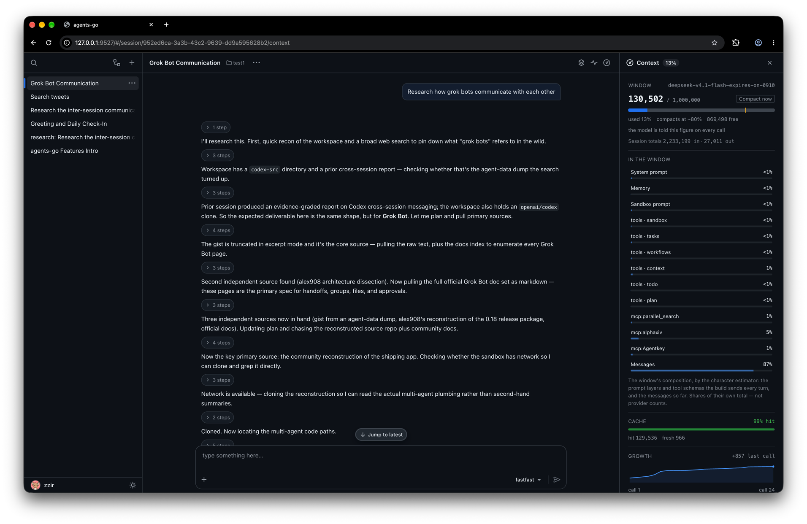

# agents-server — the agents-go workbench

The workbench's source: the Go server and, under `internal/web/frontend`, the
SPA it embeds. Its documentation lives with the rest of the project in
[`docs/`](../../docs/README.md); [Running the workbench](../../docs/tutorial/workbench.md)
goes from a release binary, or `make build` here, to a first session.

## Development loop

`make dev` starts the Vite dev server (`npm run dev` in
`internal/web/frontend`), which proxies `/api` and `/ws` to a backend on
`127.0.0.1:9527` — start one with `go run . --token X` (add `--db` for a
scratch database) and edit under `src/` with hot reload. `go run .` embeds
`internal/web/frontend/dist`, so it needs one build of the SPA first
(`make frontend`, or `go generate ./internal/web`). `./scripts/ci.sh` at the
repo root is CI locally; its frontend steps are `npm install`, `npm run lint`,
`npm run build` (`tsc --noEmit`, `vitest run`, `vite build`, then gzip) and
`npm audit --omit=dev --audit-level=high`. The lockfile is deliberately not
committed (`package-lock.json` is gitignored), so the tree `npm install`
resolves today is what gets built and audited.

## In this directory

- **The wire surface.** What the API and the WebSocket mean is
  [`docs/reference/protocol.md`](../../docs/reference/protocol.md), the two
  WebSocket changes still open its last section; the live definition is
  [`internal/protocol/messages.go`](internal/protocol/messages.go), mirrored
  in [`src/lib/protocol.ts`](internal/web/frontend/src/lib/protocol.ts).
- **Generated API surface.** A handler annotation change is three commands:
  `make openapi` here (writes `internal/docs/swagger.yaml`), `npm run gen:api`
  in `internal/web/frontend` (writes `src/lib/apiTypes.gen.ts`), then commit
  both. CI fails when either is stale, and lints the frontend. A settings
  registry change is one more: `make settings-doc` rewrites the runtime
  settings table of [`docs/reference/configuration.md`](../../docs/reference/configuration.md),
  and the settings tests fail while it is stale.
